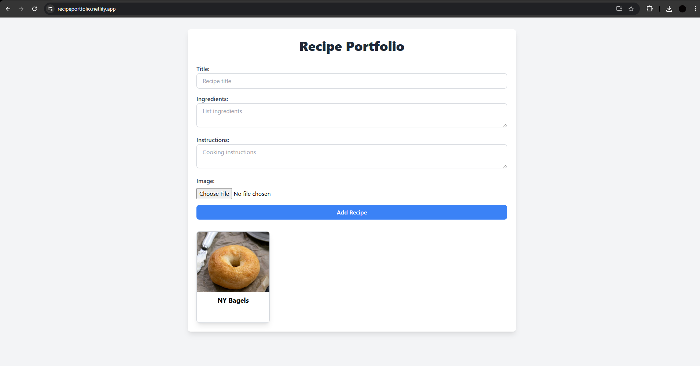
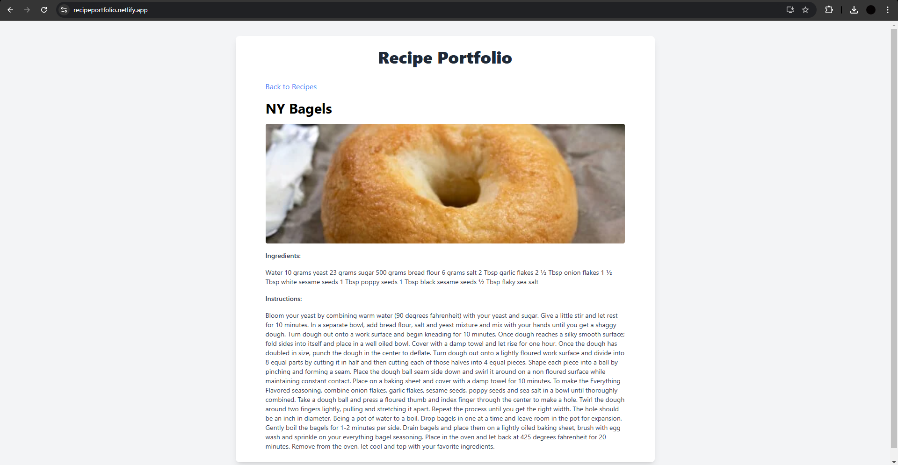

# Recipe Portfolio

React-based app that allows users to input recipe details along with a picture which is locally saved for future viewing. 

**Try it out!** [Recipe App on Netlify](https://recipeportfolio.netlify.app/)

 

## Technologies Used

- React
- TypeScript
- Tailwind CSS
- Netlify

License
This project is open source and available under the MIT License.
